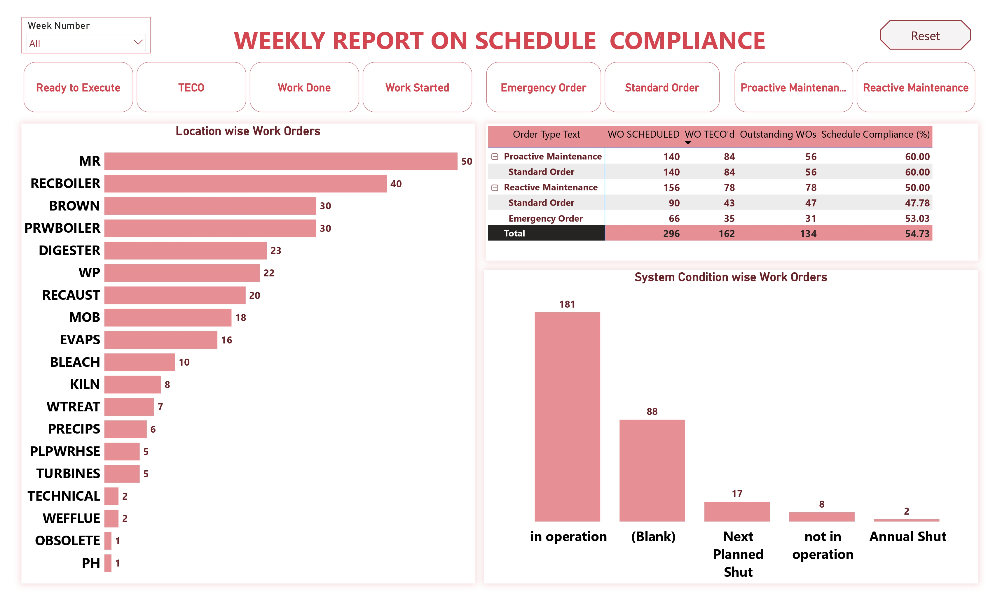

# Weekly Schedule Compliance Dashboard

## 📌 Project Overview

The **Weekly Schedule Compliance Dashboard** is a comprehensive Power BI solution developed to monitor maintenance work orders, evaluate schedule compliance, and track maintenance execution performance across different plant locations and system conditions.

This dashboard enables maintenance managers, planners, and operational teams to gain actionable insights into work order completion, backlog management, proactive versus reactive maintenance activities, and overall schedule adherence.

The data for this project was sourced from **Microsoft Excel** and transformed into meaningful visual insights using Power BI.

---

## 🎯 Business Objective

The main objective of this dashboard is to:

- Monitor weekly maintenance performance.
- Measure schedule compliance across maintenance activities.
- Track completed and outstanding work orders.
- Analyze proactive and reactive maintenance orders.
- Identify high-maintenance locations.
- Improve maintenance planning and resource allocation.
- Support data-driven operational decision-making.

---

## 🛠️ Tools & Technologies Used

| Tool | Purpose |
|--------|----------|
| Power BI | Data Visualization & Dashboard Development |
| Microsoft Excel | Data Source |
| Power Query | Data Cleaning & Transformation |
| DAX | KPI Calculations and Measures |

---

## 📂 Data Source

**Source:** Microsoft Excel

---

## 📊 Dashboard Features

### 1️⃣ Week Number Filter

An interactive slicer that allows users to filter the dashboard based on a specific week.

**Benefits:**
- Weekly performance analysis
- Dynamic filtering
- Faster decision-making

---

### 2️⃣ KPI Summary Cards

The dashboard includes key maintenance performance indicators:

#### Ready to Execute
Displays work orders ready for execution.

#### TECO
Represents technically completed work orders.

#### Work Done
Shows completed maintenance activities.

#### Work Started
Displays initiated maintenance work.

#### Emergency Order
Tracks urgent maintenance requests.

#### Standard Order
Shows routine maintenance activities.

#### Proactive Maintenance
Monitors preventive maintenance efforts.

#### Reactive Maintenance
Tracks breakdown and corrective maintenance activities.

---

### 3️⃣ Location-wise Work Orders Analysis

A horizontal bar chart displaying the number of work orders across plant locations.

#### Locations Included

- MR
- RECBOILER
- BROWN
- PRWBOILER
- DIGESTER
- WP
- RECAUST
- MOB
- EVAPS
- BLEACH
- KILN
- WTREAT
- PRECIPS
- PLPWRHSE
- TURBINES
- TECHNICAL
- WEFFLUE
- OBSOLETE
- PH

#### Insights

- Identifies locations with the highest workload.
- Helps allocate maintenance resources efficiently.
- Supports workload balancing across departments.

---

### 4️⃣ Schedule Compliance Matrix

Provides a detailed breakdown of:

- Scheduled Work Orders
- TECO Completed Work Orders
- Outstanding Work Orders
- Schedule Compliance Percentage

#### Maintenance Categories

##### Proactive Maintenance
- Standard Order

##### Reactive Maintenance
- Standard Order
- Emergency Order

#### Insights

- Measures maintenance execution efficiency.
- Tracks pending work orders.
- Evaluates overall schedule adherence.

---

### 5️⃣ System Condition-wise Work Orders

A column chart categorizing work orders by system condition.

#### Categories

- In Operation
- Next Planned Shut
- Not in Operation
- Annual Shut
- Blank / Unspecified

#### Insights

- Understands equipment operating conditions.
- Supports maintenance planning.
- Highlights shutdown-related maintenance activities.

---

## 🔍 Business Insights Generated

This dashboard helps organizations:

- Improve maintenance scheduling.
- Reduce maintenance backlog.
- Monitor work execution efficiency.
- Increase schedule compliance rates.
- Identify critical maintenance areas.
- Track proactive versus reactive maintenance activities.
- Optimize workforce utilization.

---

## 📸 Dashboard Preview

> Save your dashboard screenshot as **Dashboard.jpg** in the repository root folder.

```markdown


```


---

## ⭐ Key Highlights

- Interactive Power BI Dashboard
- Excel-Based Data Source
- Maintenance Work Order Analytics
- Schedule Compliance Monitoring
- KPI Tracking
- Dynamic Filtering
- Location-wise Performance Analysis
- System Condition Monitoring
- Maintenance Planning Insights

---

## 📌 Future Enhancements

- Monthly and Yearly Trend Analysis
- Predictive Maintenance Insights
- Maintenance Cost Analysis
- Resource Utilization Tracking
- Automated Data Refresh

---

## 👨‍💻 Author

### Arjun Arora
